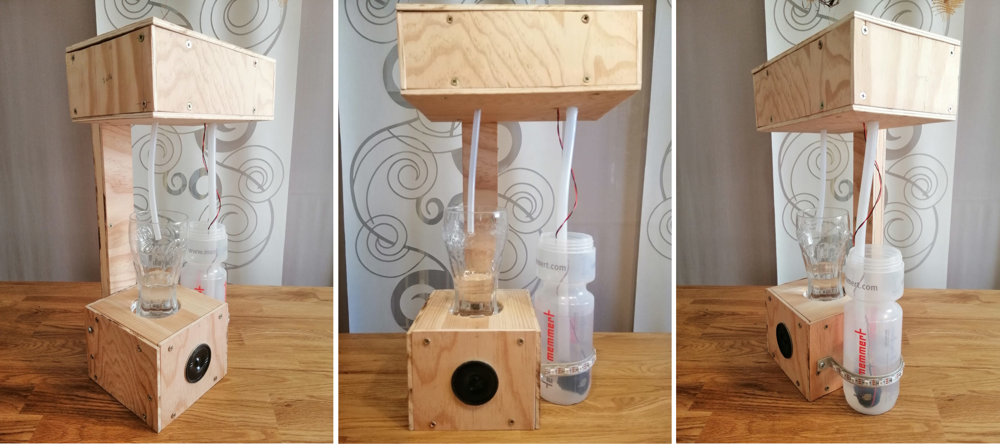
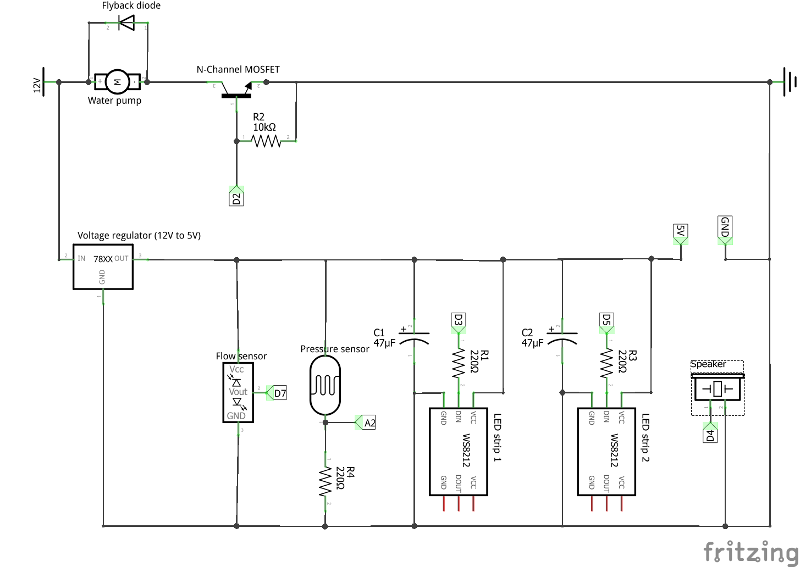
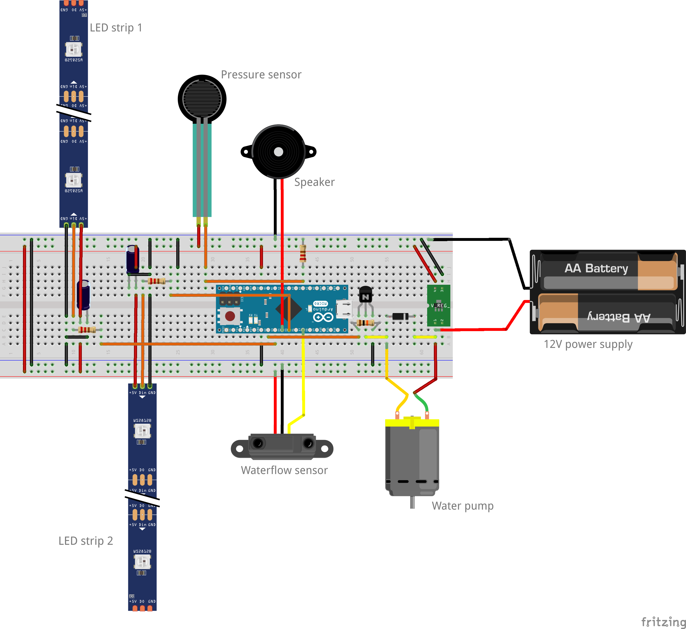

# DrinkReminder
## What is DrinkReminder?
DrinkReminder is my final assignment for the module "Sketching with Hardware" at the University of Regensburg. We should apply the hardware programming knowledge we have learned over this course and develop a prototype based on the topic "a helper in everyday life". Since I've always struggled to consume enough water (especially at work), I decided to implement a device that "forces" regular water consumption.

## Concept
The DrinkReminder reminds you of a certain amount of water at regular intervals so that the daily amount required is covered. For a daily requirement of 2.5 liters, that would be just under 80ml of water per 30 minutes (assuming that a day only consists of 16 hours, since 8 hours of bedtime are omitted). During the period in which the device is running, you are also reminded of the amount of water that would have to be drunk in this period to meet the daily requirement. Reminding takes the form of a visual signal, the flashing of the LED strip next to the water glass, and a simultaneous acoustic signal emitted by the loudspeaker.

As long as the user is behind the prescribed water consumption, he is reminded to drink again at smaller intervals in addition to the actual “main reminder”. Conversely, the device no longer emits a signal for a longer period of time if the user has already drunk beforehand (e.g. if 80ml are drunk three times in the first half an hour, no signal will appear for the next 1.5 hours). The device is designed to relieve the user of as much work as possible and therefore includes an automatic refill function when the glass is empty. Only the amount of water that has to be drunk per unit of time is topped up (in this case 80ml).

In addition, the TrinkReminder contains a protective mechanism that switches off the water pump if the glass is removed from the platform during automatic refilling. When it put down again, the remaining water amount is then pumped into the glass.

Since the device is primarily intended for use in concentration phases, which usually take place at the desk in front of the PC, the design was chosen accordingly. The device should therefore take up as little work surface as possible, which is why it was built more vertically than horizontally. In addition, the glass and the water bottle must be secured so that they cannot be spilled every time they are touched, which could ultimately have fatal consequences in the workplace. For this reason, the glass was embedded approx. 1.5 cm into the storage platform and a holder for the bottle was attached to the side of the base. These two protective measures have two other advantages at the same time. On the one hand, they give the device a certain affordance and thus support the user in correctly placing the glass and bottle. On the other hand, this created additional space that can be used for further user feedback in the form of LED strips.

## Implementation

The case of the prototype is made entirely of wood. It can be roughly divided into three parts. In the following they are referred to as "lower box", "connector" and "upper box".

The lower box forms the basis of the prototype. It contains a storage platform for the glass, on the inside of which an LED strip is attached, which lights up when the user is reminded to drink. The platform on which the glass is placed is constructed in such a way that the weight of the glass can be transferred as best as possible to the pressure sensor, which can then determine the current state of the glass (no glass available, empty glass or glass still contains water). The speaker is located on the front of the box and provides an acoustic signal in addition to the visual signal from the LED strip. The bottle holder is attached to the side of the box, to which there is also an LED strip that signals an empty bottle. Inside the box is the circuit board on which all sensors and components are combined, as well as the Arduino micro, which forms the control unit of the prototype. It reads the sensor values for the pressure sensor and the waterflow sensor and generates output signals for the water pump, the speaker and the two LED strips.

The connector is attached to the back of the lower box. The hollow interior allows the laying of all cables that have to run from the periphery to the center, the circuit board.

The upper box is attached to the upper end of the connector. This is where the water flow sensor is located, via which the water hoses of the bottle and those of the glass are connected to one another. The Waterflow Sensor is used to measure the amount of water that has flowed through the hose and thus enables the glass to be filled precisely with the desired amount of water. At the end of the hose that is to be placed in the water bottle, there is the water pump, which is used as a submersible pump.

[Here](https://drive.google.com/file/d/1NYYfiuUKreTmq-CTUE_9-hm8xS0JJWKC/view?usp=sharing) is a video that demonstrates the functionality of the prototype.

## Circuit/ Breadboard

Sketch of the circuit. The labels D2, A2, etc. represent the digital and analog pins of the Arduino micro. Resistor and capacitor values can be seen in the figure. The water pump is controlled via the Arduino using the transistor. To prevent the inductive voltage pulse on turnoff of the water pump, a flyback diode was connected in parallel. 

Sketch of the circuit on the breadboard. The batteries represent the 12V power supply.

## Links to the built-in compenents
- Microcontroller (Arduino Mikro): https://store.arduino.cc/arduino-micro
- LED-Strips: https://cdn-shop.adafruit.com/datasheets/WS2812B.pdf
- Pressure sensor: https://www.trossenrobotics.com/productdocs/2010-10-26-DataSheet-FSR402-Layout2.pdf
- Speaker: https://cdn-reichelt.de/documents/datenblatt/I900/VIS_K40SQ.pdf
- Waterflow sensor: https://www.robotics.org.za/YF-S401
- Water pump: https://www.pollin.de/productdownloads/D330056D.PDF
- Transistor: https://www.infineon.com/dgdl/irlz34npbf.pdf?fileId=5546d462533600a40153567206892720
- Voltage reulator module: https://www.pollin.de/productdownloads/D351560D.PDF
